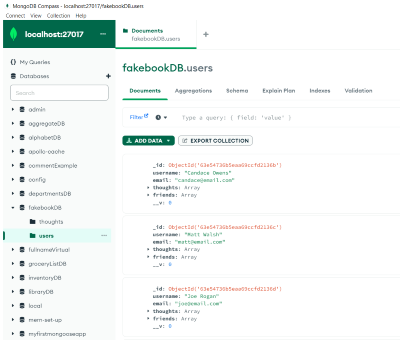
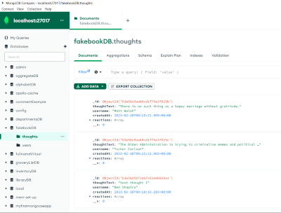

# fakebook

Fakebook is a social media back end database created in Visual Studio using Mongoose and tested in Insomnia.
When the API is opened in Insomnia there are routes ready to test creating a new user, new thoughts, reactions to thoughts and to add friends to a user.
all of the previous unformation can be eraser and updated.

## Visuals

### Video links

[Demo of starting the server and testing user routes in Insomnia](./run-user.webm)

[Demo testing thought routes in Insomnia](./thoughts.webm)

[Demo testing reactions,befriend and unfriend routes in Insomnia](./reactions-friends.webm)

### Images

Users MongoDB

Thoughts MongoDB

